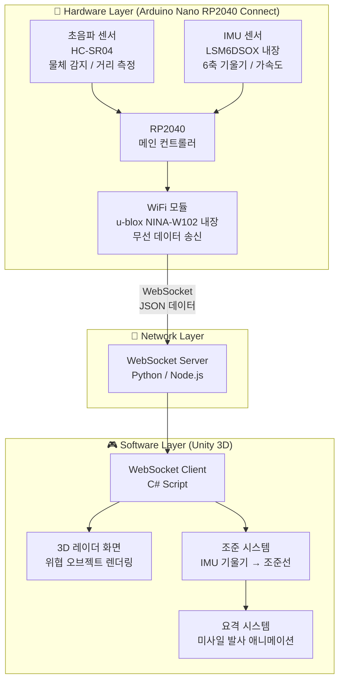
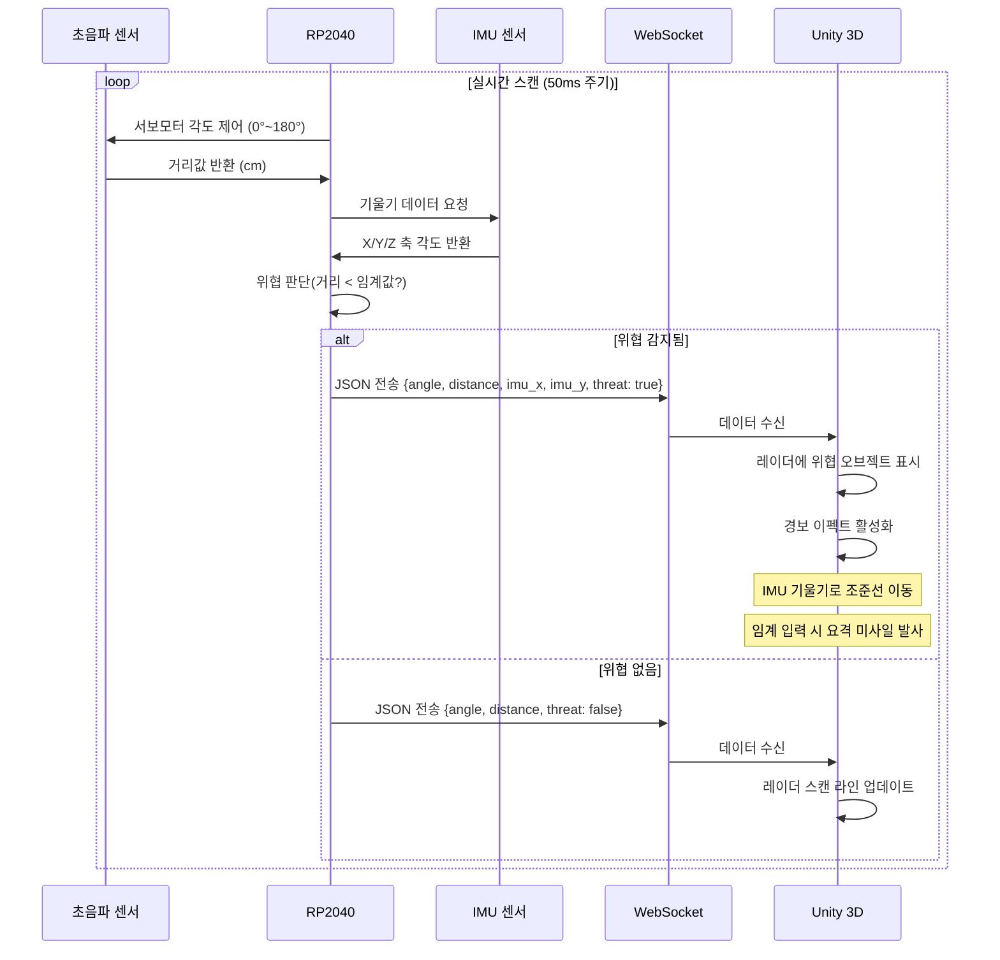
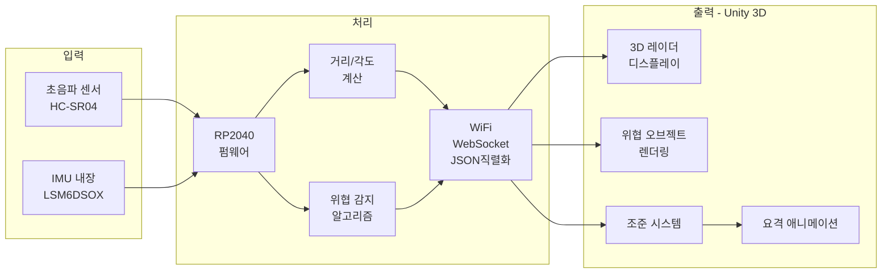
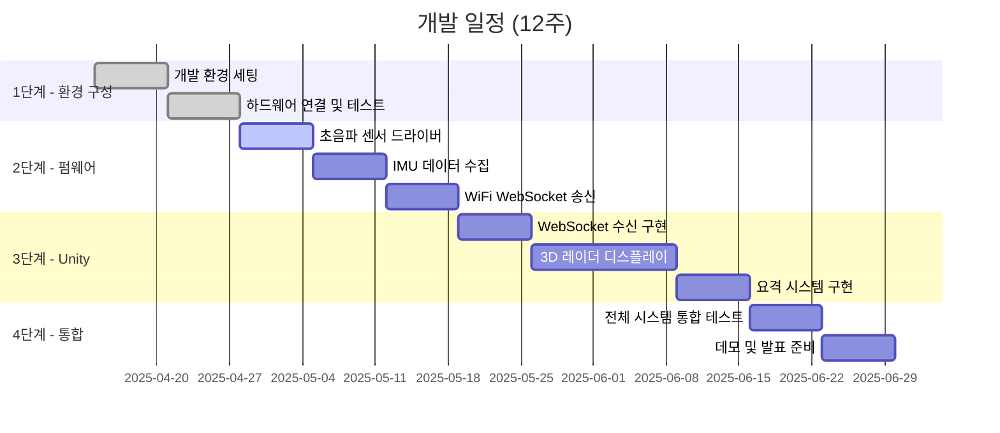

# 🛡️ 3D Air Defense Radar System
### Arduino Nano RP2040 Connect + Unity 3D 실시간 방공 시뮬레이션

<p align="center">
  
  
  
  
  
</p>

---

## 📌 개요

실제 물체를 초음파 센서로 감지하고, IMU 센서로 조준 방향을 입력받아
Unity 3D 화면에서 실시간 방공 레이더 시뮬레이션을 구현한 **임베디드-가상현실 연동 시스템**입니다.

> "현실 세계의 센서 데이터가 가상 3D 공간에서 즉각적으로 반응한다"

---

## 🎯 개발 목적

| 목적 | 설명 |
|------|------|
| **임베디드-가상현실 연동** | 실물 하드웨어와 Unity 3D 엔진의 실시간 양방향 통신 구현 |
| **실시간 센서 시각화** | 초음파/IMU 센서 데이터를 3D 공간에 즉각 반영 |
| **자율 감지 및 반응 시스템** | 위협 감지 → 판단 → 요격이라는 목적 있는 자동화 흐름 구현 |
| **포트폴리오** | 임베디드 펌웨어 + 무선 통신 + 3D 렌더링을 단일 시스템으로 통합 |

---

## 🏗️ 시스템 아키텍처



---

## 🔄 데이터 흐름도



---

## 🧩 시스템 구성 요소



---

## 🛠️ 기술 스택

### Hardware

| 구성 요소 | 모델 | 역할 |
|-----------|------|------|
| **메인 보드** | Arduino Nano RP2040 Connect | 메인 컨트롤러 |
| **거리 센서** | HC-SR04 초음파 센서 | 물체 감지 및 거리 측정 |
| **IMU** | LSM6DSOX (내장) | 기울기 기반 조준 입력 |
| **통신** | u-blox NINA-W102 (내장) | WiFi WebSocket 통신 |

### Software

| 구성 요소 | 기술 | 역할 |
|-----------|------|------|
| **펌웨어** | Arduino C++ | 센서 제어 및 데이터 처리 |
| **통신 프로토콜** | WebSocket + JSON | 실시간 양방향 통신 |
| **3D 엔진** | Unity 2022 LTS (C#) | 3D 레이더 화면 및 시뮬레이션 |
| **데이터 포맷** | JSON | 센서 데이터 직렬화 |

---

## 📁 프로젝트 구조

```
3D-Air-Defense-Radar/
│
├── 📂 firmware/                    # Arduino RP2040 펌웨어
│   ├── main.ino                    # 메인 루프
│   ├── sensor/
│   │   ├── ultrasonic.h           # 초음파 센서 드라이버
│   │   └── imu.h                  # IMU 센서 드라이버
│   ├── comm/
│   │   └── websocket_client.h     # WiFi WebSocket 송신
│   └── config.h                   # 핀 설정, 임계값 상수
│
├── 📂 unity-project/               # Unity 3D 프로젝트
│   └── Assets/
│       ├── Scripts/
│       │   ├── WebSocketReceiver.cs    # 데이터 수신
│       │   ├── RadarDisplay.cs         # 3D 레이더 렌더링
│       │   ├── ThreatManager.cs        # 위협 오브젝트 관리
│       │   ├── AimController.cs        # IMU 기반 조준 제어
│       │   └── InterceptSystem.cs      # 요격 미사일 시스템
│       ├── Prefabs/
│       │   ├── ThreatObject.prefab     # 위협 오브젝트
│       │   └── Missile.prefab          # 요격 미사일
│       └── Scenes/
│           └── RadarScene.unity        # 메인 씬
│
└── 📂 docs/                        # 문서
    ├── wiring_diagram.png          # 배선도
    └── demo.gif                    # 데모 영상
```

---

## 🔌 배선도

```
Arduino Nano RP2040 Connect
│
├── D2  ──── HC-SR04 TRIG
├── D3  ──── HC-SR04 ECHO
├── 5V  ──── HC-SR04 VCC
├── GND ──── HC-SR04 GND
│
├── [IMU LSM6DSOX - 내장, 배선 불필요]
└── [WiFi u-blox  - 내장, 배선 불필요]
```

> ⚡ 초음파 센서 4핀 연결이 외부 배선의 전부입니다.

---

## 🚀 개발 로드맵



---

## 🎮 데모 시나리오

```
1. 시스템 부팅
   └─ RP2040 WiFi 연결 → Unity 3D 레이더 화면 활성화

2. 스캔 시작
   └─ 초음파 센서 자동 180° 스캔
   └─ Unity 레이더에 스캔 라인 실시간 회전

3. 위협 감지
   └─ 손/물체를 센서 앞에 가져다 댐
   └─ Unity 레이더에 붉은 위협 오브젝트 즉각 표시
   └─ 경보음 + 이펙트 활성화

4. 요격
   └─ 보드 기울여서 조준선 이동 (IMU)
   └─ 조준 완료 시 요격 미사일 발사 애니메이션
   └─ 위협 오브젝트 소멸 이펙트
```

---

## 📊 기대 성능 목표

| 항목 | 목표값 |
|------|--------|
| **센서 스캔 주기** | 50ms 이하 |
| **WiFi 전송 지연** | 100ms 이하 |
| **Unity 렌더링** | 60 FPS 유지 |
| **감지 거리** | 5cm ~ 200cm |
| **IMU 반응 지연** | 30ms 이하 |

---

## 👨‍💻 개발자

| 항목 | 내용 |
|------|------|
| **이름** | 창연 |
| **학과** | 임베디드소프트웨어학과 |
| **GitHub** | [@changyeon47](https://github.com/changyeon47) |
| **유형** | 개인 졸업작품 |

---

## 📄 라이선스

MIT License © 2025 changyeon47
