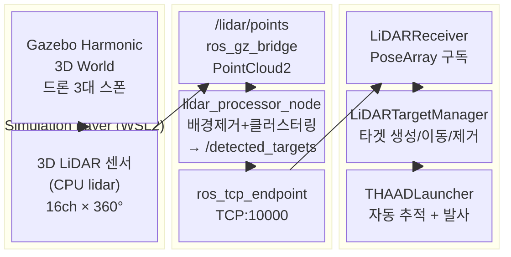
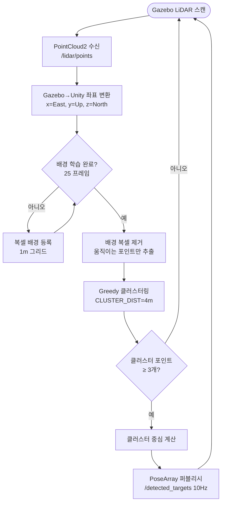
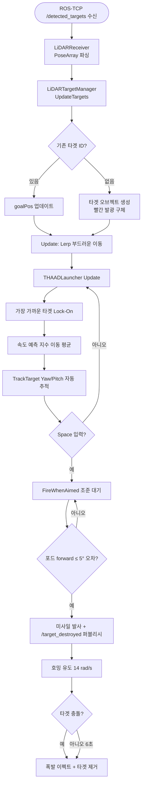

# 3D Air Defense Radar System
### Gazebo + ROS2 + Unity 3D 실시간 방공 시뮬레이션

> Gazebo Harmonic + ROS2 Jazzy + Unity 3D를 연동한 실시간 3D 방공 레이더 시뮬레이션

---

## 개발 목적

Gazebo 시뮬레이터에서 3D LiDAR 센서로 탐지한 드론 타겟을 **ROS2 토픽**으로 처리하고, Unity 3D에서 THAAD 스타일 발사대가 **자동 추적 및 요격**하는 방공 시뮬레이션 시스템을 구현합니다.

### 해결하고자 하는 문제

- Gazebo 3D LiDAR 포인트클라우드 → 배경제거 → 클러스터링 → ROS2 토픽 파이프라인 구현
- ROS2 ↔ Unity 실시간 통신 (ROS-TCP-Connector) 구조 습득
- 방공 시스템의 탐지→추적→요격 시나리오를 **직관적으로 시연**

---

## 전체 시스템 구성도



---

## 데이터 흐름

```
Gazebo LiDAR
  → /lidar/points (PointCloud2, gz_bridge)
  → lidar_processor_node (배경제거 + DBSCAN 클러스터링)
  → /detected_targets (PoseArray, 10Hz)
  → ros_tcp_endpoint (TCP:10000)
  → Unity LiDARReceiver
  → LiDARTargetManager (타겟 오브젝트 생성/이동)
  → THAADLauncher (자동 추적 → Space 발사)

Unity → /target_destroyed (Point) → ROS2 (요격 이벤트)
```

---

## LiDAR 처리 파이프라인



---

## Unity 타겟 처리 및 발사 파이프라인



---

## 기술 스택

| 구분 | 기술 |
|------|------|
| **시뮬레이터** | Gazebo Harmonic 8.x (gz-sim) |
| **로봇 미들웨어** | ROS2 Jazzy (Ubuntu 24.04 / WSL2) |
| **LiDAR 센서** | CPU lidar 16ch × 360° (Gazebo 내장) |
| **배경 제거** | 복셀 기반 Background Subtraction (1m 그리드) |
| **클러스터링** | Greedy 거리 기반 클러스터링 (4m 반경) |
| **ROS↔Unity 통신** | ROS-TCP-Connector (TCP:10000) |
| **퍼블리시 토픽** | `/detected_targets` (PoseArray), `/target_destroyed` (Point) |
| **3D 시뮬레이션** | Unity 2022.3 LTS (C#) |
| **개발 OS** | Windows 11 (Unity) / Ubuntu 24.04 WSL2 (ROS2+Gazebo) |

---

## 프로젝트 구조

```
3D-Air-Defense-Radar/
├── gazebo_ws/                          # ROS2 워크스페이스
│   └── src/air_defense_sim/
│       ├── worlds/air_defense.world    # Gazebo 월드 (LiDAR 센서 포함)
│       ├── launch/sim.launch.py        # 통합 런치 파일
│       └── air_defense_sim/
│           ├── lidar_processor_node.py # PointCloud2→클러스터링→PoseArray
│           └── target_mover_node.py    # 드론 3대 스폰 + 이동
│
├── jetson/
│   ├── lidar_server.py                 # (레거시) 2D LiDAR + WebSocket
│   └── lidar3d_sim_server.py          # 순수 Python 3D 시뮬레이터 (Gazebo 없이 테스트)
│
└── unity-scripts/                      # Unity C# 스크립트
    ├── LiDARReceiver.cs                # ROS-TCP PoseArray 구독
    ├── LiDARTargetManager.cs           # 타겟 오브젝트 생성/이동/제거
    ├── THAADLauncher.cs                # 발사대 생성 + Yaw/Pitch 추적 + 발사
    ├── MissileController.cs            # 미사일 물리 + 호밍 + /target_destroyed 퍼블리시
    ├── MissileCamera.cs                # 메인 카메라 (런처뷰/미사일뷰)
    ├── OverviewCamera.cs               # 전체 조망 PIP (우하단)
    ├── AimCamera.cs                    # 조준 1인칭 PIP (우상단)
    ├── RadarDisplay.cs                 # 2D 레이더 HUD
    ├── ExplosionEffect.cs              # 폭발 파티클 이펙트
    ├── SceneSetup.cs                   # 씬 자동 구성 (지형/조명/환경)
    └── SceneSetup.cs                   # 씬 자동 구성
```

---

## 실행 방법

### 환경

- WSL2 Ubuntu 24.04 + ROS2 Jazzy + Gazebo Harmonic
- Windows 11 + Unity 2022.3 LTS

### 1. WSL — Gazebo 시뮬레이션 실행

```bash
cd ~/gazebo_ws
source /opt/ros/jazzy/setup.bash
source install/setup.bash
ros2 launch air_defense_sim sim.launch.py
```

### 2. WSL — ROS-TCP-Endpoint 실행 (별도 터미널)

```bash
source /opt/ros/jazzy/setup.bash
ros2 run ros_tcp_endpoint default_server_endpoint --ros-args -p ROS_IP:=0.0.0.0
```

### 3. Unity 설정

1. `AirDefenseRadar` Unity 프로젝트 열기
2. **Robotics → ROS Settings** 에서 ROS IP 입력

   ```bash
   # WSL IP 확인
   hostname -I | awk '{print $1}'
   ```

3. **AirDefense → Build Scene** 으로 씬 생성
4. Play 버튼 클릭

### 4. 조작

| 키 | 동작 |
|----|------|
| `Space` | 미사일 발사 (포드가 타겟 추적 중일 때) |

---

## 주요 파라미터

### lidar_processor_node.py

| 파라미터 | 기본값 | 설명 |
|---------|--------|------|
| `BG_LEARN_FRAMES` | 25 | 배경 학습 프레임 수 |
| `BG_VOXEL_SIZE` | 1.0 m | 배경 복셀 크기 |
| `CLUSTER_DIST` | 4.0 m | 클러스터 묶음 거리 |
| `MIN_CLUSTER_PTS` | 3 | 최소 클러스터 포인트 수 |
| `SENSOR_Z_OFFSET` | 2.0 m | LiDAR 센서 높이 오프셋 |

### LiDARTargetManager (Unity Inspector)

| 파라미터 | 기본값 | 설명 |
|---------|--------|------|
| `use3DHeight` | true | 수신 Y좌표 사용 여부 |
| `positionScale` | 1 | 위치 배율 |
| `targetSize` | 2.5 | 타겟 구체 크기 |
| `removeTimeout` | 1.5 s | 미감지 시 제거 대기 시간 |

## 실행 영상
 Youtube 링크 : https://youtu.be/5MsQs7Yd8cs


