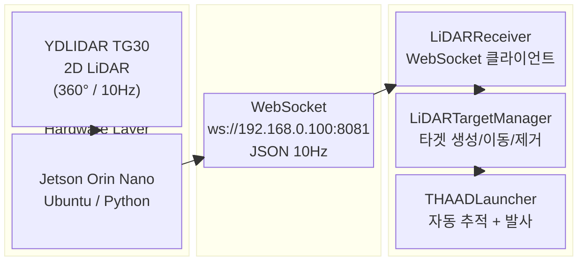
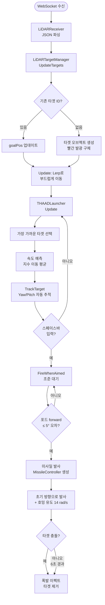
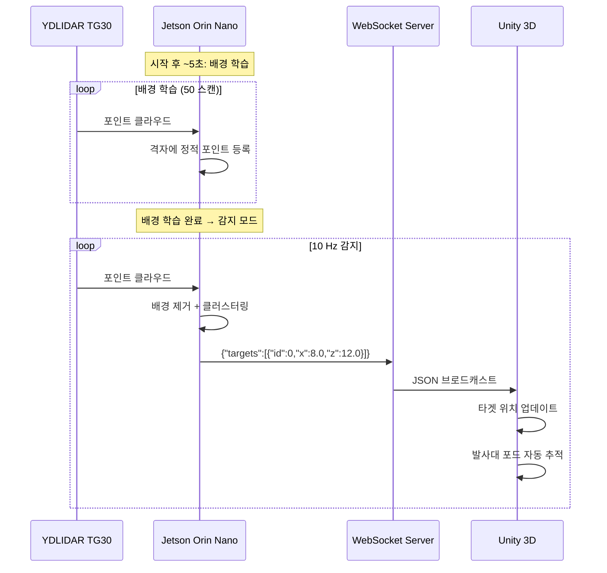
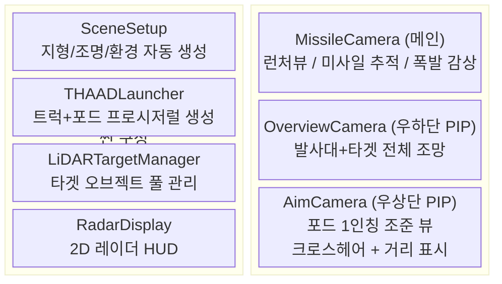
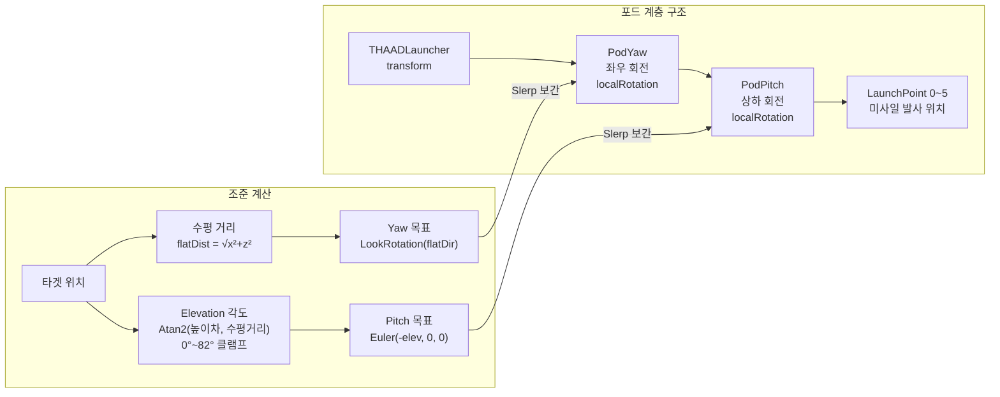

# 3D Air Defense Radar System
### LiDAR 기반 실시간 3D 방공 시뮬레이션

> YDLIDAR TG30 + Jetson Orin Nano + Unity 3D를 연동한 실시간 방공 레이더 시뮬레이션 졸업작품

---

## 개발 목적

실제 2D LiDAR 센서로 탐지한 움직이는 물체를 **3D 공간에 실시간으로 시각화**하고, THAAD 스타일의 미사일 발사대가 해당 타겟을 **자동 추적 및 요격**하는 방공 시뮬레이션 시스템을 구현합니다.

### 해결하고자 하는 문제

- 실제 센서 데이터(LiDAR)를 3D 엔진과 **실시간으로 연동**하는 파이프라인 구현
- 정적인 벽/사물과 **움직이는 물체를 구별**하여 탐지 정확도 향상
- 발사대 포드의 **정밀한 3D 조준**(Yaw/Pitch 분리 제어) 및 예측 조준 구현

### 기대 효과

- LiDAR 포인트 클라우드 → 클러스터링 → 타겟 추적 파이프라인 이해
- 실제 센서와 게임 엔진 간 **WebSocket 실시간 통신** 구조 습득
- 방공 시스템의 탐지→추적→요격 시나리오를 **직관적으로 시연**

---

## 전체 시스템 구성도



---

## 시스템 흐름도

### Jetson — LiDAR 처리 파이프라인

```mermaid
flowchart TD
    A([YDLIDAR TG30 스캔 시작]) --> B[포인트 수집\n극좌표 → 직교좌표]
    B --> C{배경 학습 완료?}

    C -- 아니오 50회 스캔 --> D[배경 격자 등록\nBG_CELL_SIZE=10cm\n정적 물체 기록]
    D --> B

    C -- 예 --> E[배경 제거\nBackground Subtraction\n정적 포인트 필터링]
    E --> F[움직이는 포인트만 추출]
    F --> G[거리 기반 클러스터링\nCLUSTER_DIST=35cm]
    G --> H{클러스터 포인트\n≥ 3개?}

    H -- 아니오 --> B
    H -- 예 --> I[클러스터 중심 계산]
    I --> J{거리 ≥\nMIN_TARGET_DIST\n1.5m?}
    J -- 아니오 --> B
    J -- 예 --> K[JSON 생성\n{id, x, z}]
    K --> L[WebSocket 브로드캐스트\n10Hz]
    L --> B
```

### Unity — 타겟 처리 및 발사 파이프라인



---

## 데이터 통신 흐름



---

## Unity 시뮬레이션 구성도



---

## 발사대 제어 구조



---

## 기술 스택

| 구분 | 기술 |
|------|------|
| **LiDAR 센서** | YDLIDAR TG30 (2D, 360°, 10Hz, 최대 30m) |
| **엣지 컴퓨팅** | NVIDIA Jetson Orin Nano (Ubuntu) |
| **LiDAR SDK** | ydlidar-sdk (Python 바인딩) |
| **배경 제거** | 격자 기반 Background Subtraction (자체 구현) |
| **클러스터링** | 거리 기반 단순 클러스터링 (자체 구현) |
| **백엔드 통신** | Python `websockets` (asyncio) |
| **3D 시뮬레이션** | Unity 2022.3 LTS (C#) |
| **WebSocket 클라이언트** | NativeWebSocket (Unity 패키지) |
| **통신 포맷** | JSON `{"targets":[{"id":int,"x":float,"z":float}]}` |
| **개발 OS** | Windows 11 (Unity) / Ubuntu (Jetson) |

---

## 프로젝트 구조

```
졸작/
├── 3D-Air-Defense-Radar/
│   └── jetson/
│       └── lidar_server.py          # LiDAR 처리 + WebSocket 서버
│
└── AirDefenseRadar/                 # Unity 프로젝트
    └── Assets/Scripts/
        ├── LiDARReceiver.cs         # WebSocket 수신 (NativeWebSocket)
        ├── LiDARTargetManager.cs    # 타겟 오브젝트 생성/이동/제거
        ├── THAADLauncher.cs         # 발사대 생성 + Yaw/Pitch 추적 + 발사
        ├── MissileController.cs     # 미사일 물리 + 호밍 유도 + 폭발
        ├── MissileCamera.cs         # 메인 카메라 (런처뷰/미사일뷰)
        ├── OverviewCamera.cs        # 전체 조망 PIP (우하단)
        ├── AimCamera.cs             # 조준 1인칭 PIP (우상단)
        ├── RadarDisplay.cs          # 2D 레이더 HUD
        ├── ExplosionEffect.cs       # 폭발 파티클 이펙트
        ├── SceneSetup.cs            # 씬 자동 구성 (지형/조명/환경)
        ├── StartupFade.cs           # 시작 페이드인
        ├── TargetSpawner.cs         # (비활성) 수동 타겟 스포너
        └── NoseHitDetector.cs       # 미사일 노즈 충돌 감지
```

---

## 실행 방법

### 1. Jetson — LiDAR 서버 시작

```bash
# LiDAR 포트 권한 설정
sudo chmod 666 /dev/ttyUSB0

# 서버 실행 (시작 후 ~5초 배경 학습)
python3 ~/lidar_server.py
```

> 배경 학습 중에는 감지 영역 안에 사람/물체가 없어야 합니다.

### 2. PC — Unity 실행

1. `AirDefenseRadar` Unity 프로젝트 열기
2. `LiDARReceiver` 컴포넌트에서 `Jetson IP` 입력 (기본: `192.168.0.100`)
3. Play 버튼 클릭

### 3. 조작

| 키 | 동작 |
|----|------|
| `Space` | 미사일 발사 (포드가 타겟 추적 중일 때) |

---

## 주요 파라미터

### lidar_server.py

| 파라미터 | 기본값 | 설명 |
|---------|--------|------|
| `BG_LEARN_FRAMES` | 50 | 배경 학습 스캔 횟수 |
| `BG_CELL_SIZE` | 0.10 m | 배경 격자 크기 |
| `MIN_TARGET_DIST` | 1.5 m | 최소 타겟 인식 거리 |
| `CLUSTER_DIST` | 0.35 m | 클러스터 묶음 거리 |
| `UNITY_SCALE` | 4.0 | LiDAR 좌표 → Unity 단위 배율 |

### LiDARTargetManager (Unity Inspector)

| 파라미터 | 기본값 | 설명 |
|---------|--------|------|
| `targetHeight` | 20 | 타겟 Y 높이 (Unity 단위) |
| `positionScale` | 4 | 위치 추가 배율 |
| `targetSize` | 2.5 | 타겟 구체 크기 |
| `lerpSpeed` | 4 | 이동 보간 속도 |

### THAADLauncher (Unity Inspector)

| 파라미터 | 기본값 | 설명 |
|---------|--------|------|
| `trackSmoothing` | 6 | 포드 추적 보간 속도 |
| `fireCooldown` | 2.5 s | 발사 쿨타임 |
| `launchAngle` | 95° | 포드 기본 발사 각도 |
| `missileSpeed` | 22 | 예측 조준용 미사일 속도 |
